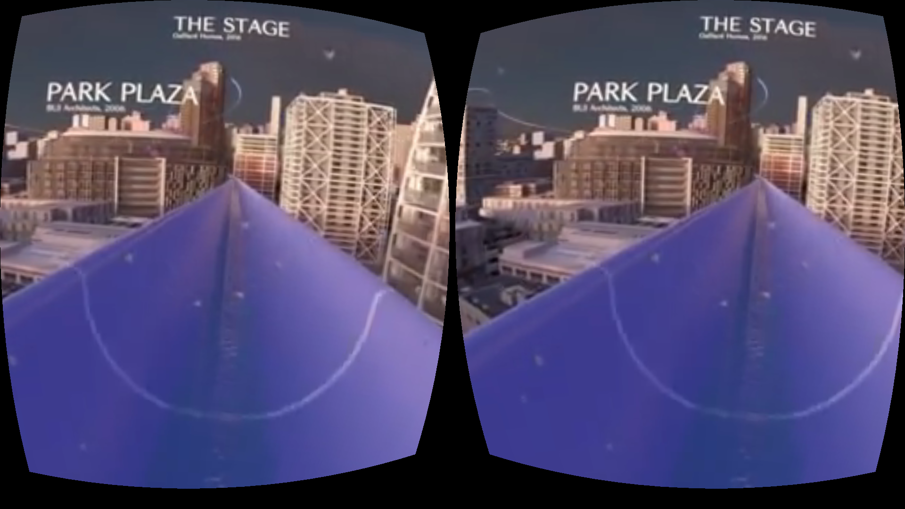
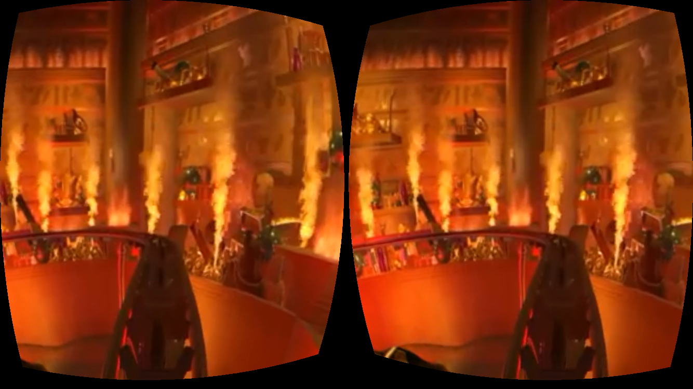

# WebVR Vedio Demo

A quick **WebVR** demo using 360 degree videos. The technique is mainly using A-frame, a wonderful WebVR framework. You can even create a **cross-platform (Android, iOS) VR app** and use **Google Cardboard** to view the WebVR app.

## Get Started

* Use the cell phone to surf the link https://jiankaiwang.github.io/webvrvideo/ by the browser.
* Click the right-bottom **Cardboard** link.
* Embed the cell phone to the cardboard and enjoy it.

## Tool

* Web Virtual Reality
  * [A-Frame](https://github.com/aframevr/aframe)

## Data

* Two main videos are refered to the youtube channel, [3D-VR-360 VIDEOS](https://www.youtube.com/channel/UCnO5ygba3vsJG9IeZLndaTQ).
  * Video(**VR_Roller_Coaster.mp4**) is mainly from https://www.youtube.com/watch?v=znuGQ-HC1ys.
  * Video(**VR_Water_Slide.mp4**) is mainly from https://www.youtube.com/watch?v=QKm-SOOMC4c.

## Demo

* Desktop View

* Android Browser View (Chrome)

* iOS Browser View (Safari)

